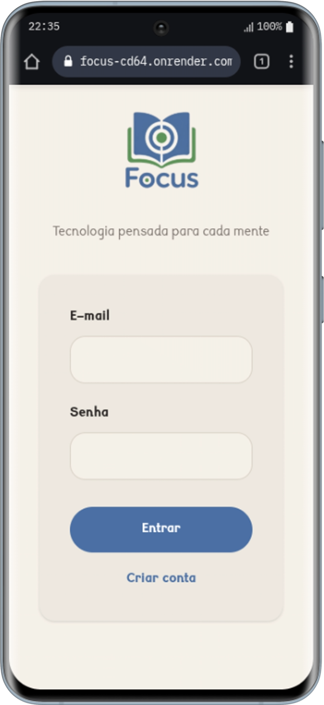
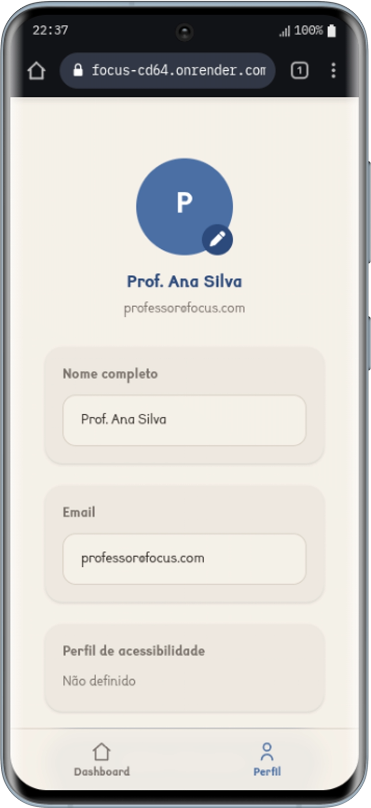
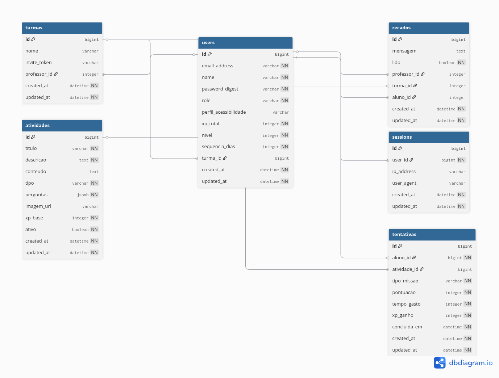

# Focus

<p align="center">
  
</p>

<p align="center">
  
</p>

## Descrição do projeto

Focus é uma PWA inclusiva voltada para estudantes com dislexia e TDAH, desenvolvida para o 2º Hackathon SIF/UniRios 2026.

O projeto busca tornar o processo de aprendizagem mais acessível, interativo e motivador por meio de missões educacionais adaptadas ao perfil de acessibilidade do aluno.

Problemas que o software se propõe a resolver:

- dificuldade de manter foco e constância nos estudos
- baixa adaptação de atividades para estudantes com dislexia e TDAH
- falta de acompanhamento visual de progresso, nível, XP e sequência de prática
- necessidade de uma experiência de aprendizado mais inclusiva, positiva e responsiva

## Tecnologias utilizadas e versões

### Backend

- Ruby 3.4.8
- Rails 8.1.3
- PostgreSQL
- Puma
- Active Storage
- Solid Queue
- Solid Cache
- Solid Cable

### Frontend

- Tailwind CSS v4 via `tailwindcss-rails`
- Chartkick
- Chart.js
- Propshaft
- Turbo

### Bibliotecas e ferramentas principais

- bcrypt 3.1.22
- pg 1.6.3
- chartkick 5.2.1
- groupdate 6.8.0
- kamal 2.11.0
- Bundler 4.0.3

### Ambiente e execução

- Foreman
- Docker
- dotenv

## Abordagens e metodologias utilizadas

- desenvolvimento web com Ruby on Rails seguindo padrão MVC
- separação de regras de negócio em service objects
- uso de acessibilidade como requisito central de produto
- gamificação com XP, níveis e sequência diária para incentivo ao aprendizado
- interface pensada para inclusão de estudantes com dislexia e TDAH
- arquitetura com controllers enxutos e lógica de negócio desacoplada
- uso de PWA para facilitar acesso multiplataforma

## Como executar o projeto

### Pré-requisitos locais

- Ruby 3.4.8
- Bundler
- PostgreSQL
- Node.js

### Configuração local

1. Instale as dependências:

```bash
bundle install
```

2. Crie o arquivo de ambiente:

```bash
cp .env.example .env
```

3. Preencha o `.env` com os dados do seu PostgreSQL local:

```env
DB_HOST=localhost
DB_PORT=5432
DB_USERNAME=seu_usuario
DB_PASSWORD=sua_senha
DB_NAME_DEV=focus_development
DB_NAME_TEST=focus_test
```

4. Prepare o banco de dados:

```bash
bin/rails db:prepare
```

5. Inicie a aplicação em desenvolvimento:

```bash
bin/dev
```

O projeto ficará disponível em:

```txt
http://localhost:3000
```

### Setup automático

Na primeira execução, você também pode usar:

```bash
bin/setup
```

Esse comando instala as dependências, prepara o banco e inicia o servidor de desenvolvimento.

### Seeds de demonstração

Para carregar os dados iniciais de demonstração:

```bash
bin/rails db:seed
```

As seeds criam:

- professor demo
- turma padrão com código de convite
- aluno demo vinculado à turma
- atividades de leitura, foco e desafio

Credenciais geradas pelas seeds:

```txt
Professor
email: professor@focus.com
senha: focus123

Aluno
email: aluno@focus.com
senha: focus123

Código da turma
FOCUS2026
```

### Executar com Docker Compose

O projeto possui um ambiente de desenvolvimento com `compose.yml` e `Dockerfile.dev`.

1. Crie o arquivo de ambiente:

```bash
cp .env.example .env
```

2. Preencha ao menos as variáveis de banco no `.env`:

```env
DB_USERNAME=seu_usuario
DB_PASSWORD=sua_senha
DB_NAME_DEV=focus_development
DB_NAME_TEST=focus_test
```

3. Suba os containers:

```bash
docker compose up --build
```

A aplicação ficará disponível em `http://localhost:3000`.

## Estrutura funcional do projeto

Atualmente o sistema possui funcionalidades como:

- cadastro e autenticação de usuários
- definição de perfil de acessibilidade
- missões por tipo: leitura, foco e desafio
- cálculo de XP por desempenho
- acompanhamento de nível e sequência
- tela de conquistas
- histórico do aluno com gráficos semanais
- edição de perfil com foto
- gestão de turmas para professores
- envio de recados para alunos
- PWA com manifesto e service worker

## Tipos de usuário

- `aluno`
- `professor`

## Modelo lógico do banco de dados


